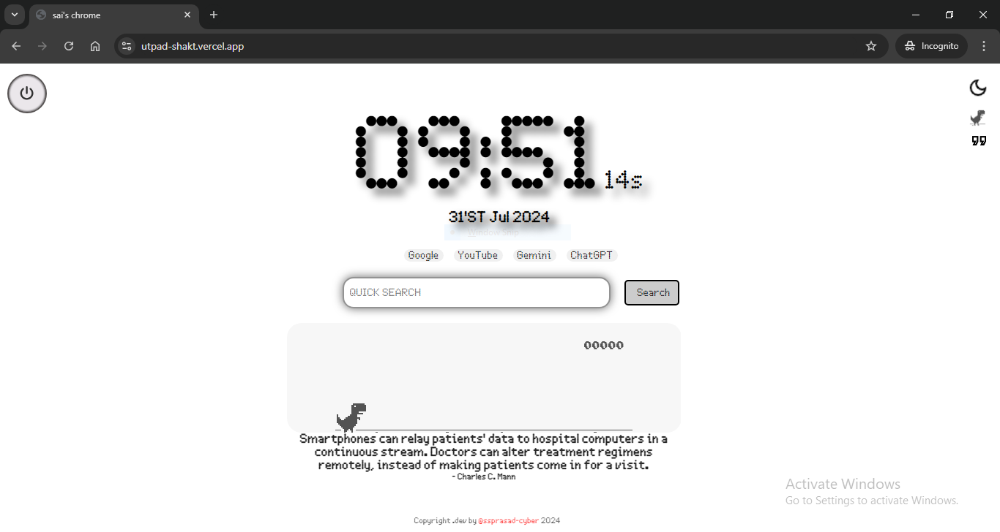
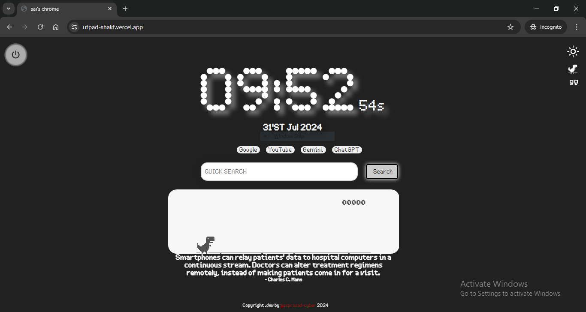
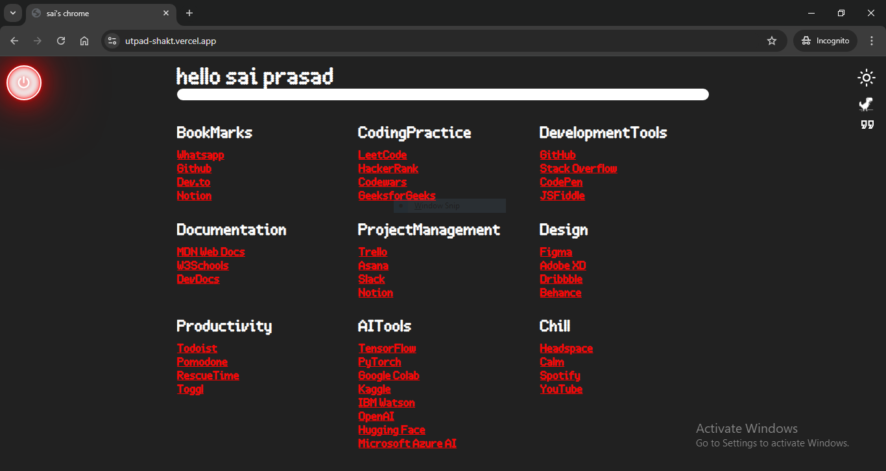

# UtpadShakt  [chrome new tab]

**UtpadShakt** is a customizable Chrome extension designed to enhance your new tab experience. It allows you to set a personalized homepage with various interactive features, including a Dino game and inspirational quotes. The extension offers a streamlined and customizable interface for a more enjoyable browsing experience.

## Description

UtpadShakt transforms the default new tab page of Chrome into a dynamic and personalized homepage. It includes features such as a Dino game for entertainment, inspirational quotes for motivation, and customization options for themes and visibility of elements. Designed with a clean and user-friendly interface, UtpadShakt aims to improve productivity and provide a unique browsing experience.

## Features

- **Custom Homepage**: Set a personalized page for new tabs.
- **Dino Game**: Built-in Dino game for quick entertainment.
- **Inspirational Quotes**: Display random motivational quotes.
- **Theme Customization**: Toggle between dark and light modes.
- **Visibility Options**: Hide or show quotes and games as needed.
- **Productivity Links**: Access quick links to productivity tools and bookmarks.

## Shortcuts

- **Shift+D**: Activate Dino game.
- **Shift+Q**: Toggle quotes display.
- **Esc**: Open bookmarks section.
- **Single Tap on Search Engine Checkbox**: Set the search engine for the search box.
- **Double Tap on Search Engine Checkbox**: Redirect to the selected search engine’s homepage.

## Screenshots
<div style="display: flex; overflow-x: auto;">
  
  
  
</div>


## Manual Installation

To manually install the UtpadShakt Chrome extension:

1. **Download or Clone the Repository**
   ```bash
   git clone https://github.com/ssprasad-cyber/utpadShakt.git
Alternatively, download the ZIP file from the GitHub repository and extract it.

2. **Load the Extension in Chrome**

 - Open Chrome and go to chrome://extensions/.
 - Enable "Developer mode" using the toggle switch.
 - Click on "Load unpacked" and select the directory where you have the UtpadShakt files.
 - Verify Installation

After loading, the new tab page should reflect the customized homepage setup by UtpadShakt.

## Cloning and Contribution

To contribute to **UtpadShakt**, follow these steps:

### Fork the Repository

1. Click the "Fork" button on the [UtpadShakt GitHub page](https://github.com/ssprasad-cyber/utpadShakt).

### Clone Your Fork

2. Clone the repository to your local machine:
   ```bash
   git clone https://github.com/YOUR_USERNAME/utpadShakt.git
### Create a New Branch
3. Create a new branch for your feature or bug fix:
   ```bash
    git checkout -b your-feature-branch
### Make Your Changes
4. Implement your changes and test thoroughly.
### Push Changes and Create a Pull Request
5. Push your changes to your forked repository:

   ```bash
    git add .
    git commit -m "Your message about the changes"
    git push origin your-feature-branch
6. Go to the UtpadShakt GitHub repository and create a pull request with your changes.

## License
This project is licensed under the GNU General Public License v3.0 (GPL-3.0). For more details, please refer to the LICENSE file.

## Copyright
Copyright (c) 2024 Sai Prasad. All rights reserved.
